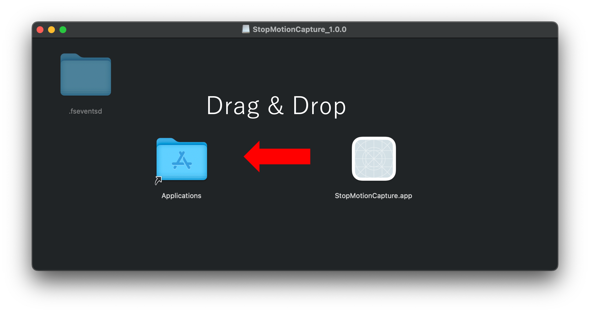

# Stop Motion Capture
- [Stop Motion Capture](#stop-motion-capture)
  - [How to Install](#how-to-install)
    - [1. Download Application Disk Image (.dmg)](#1-download-application-disk-image-dmg)
    - [2. Drag \& Drop into Applications](#2-drag--drop-into-applications)
    - [3. Erase unnecessary files](#3-erase-unnecessary-files)

## How to Install
### 1. Download Application Disk Image (.dmg)
Run the commands below to download Application Disk Image.
```zsh
git clone https://github.com/fumito100111/stop-motion-capture.git && cd stop-motion-capture
hdiutil mount StopMotionCapture_1.0.0.dmg
open /Volumes/StopMotionCapture_1.0.0
```

### 2. Drag & Drop into Applications
As below, Drag & Drop into Applications


### 3. Erase unnecessary files
Run the commands below to erase unnecessary files.
```zsh
hdiutil detach /Volumes/StopMotionCapture_1.0.0
cd .. && rm -rf stop-motion-capture
```